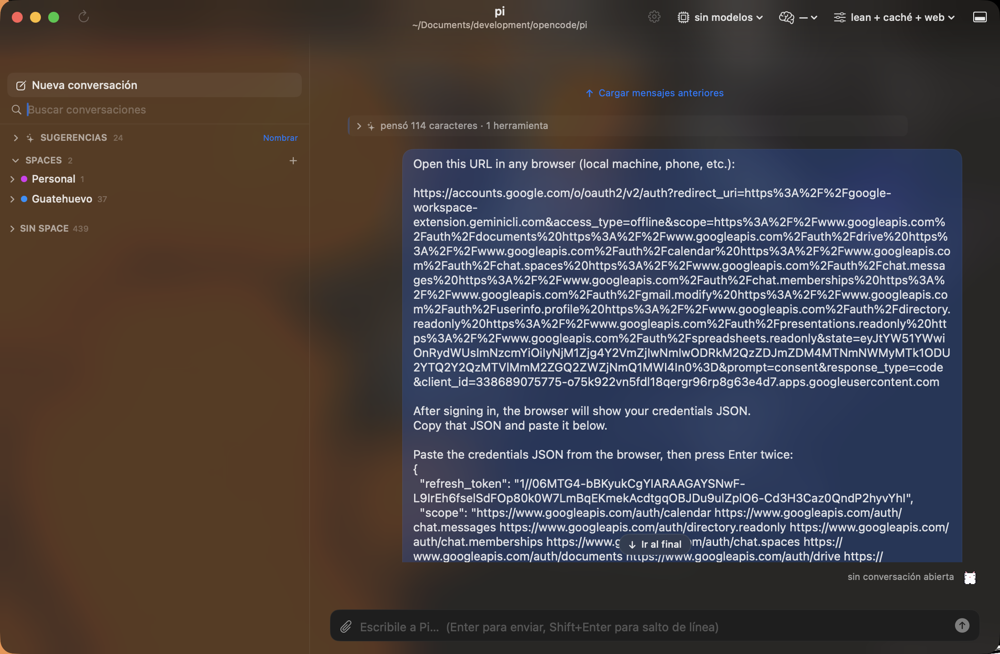

# P4W

**A native macOS GUI for [Pi](https://pi.dev), the AI coding agent.** Universal binary (arm64 + x86_64),
macOS 15 (Sequoia) or newer, **zero dependencies** — no Electron, no Tauri, no web view.




---

## Why this exists

Pi runs in a terminal, and that is exactly right for the people who live in one. My wife does not.

I wanted her to be able to talk to the same Pi — same conversations, same config, same machine — without
learning a terminal multiplexer. So P4W is a **front-end for the `pi` already installed on the machine**: it
shares `~/.pi/agent/`, so a conversation started in the terminal shows up here, and vice versa. Nothing to
configure, nothing to import, no separate account.

Then it turned out I wanted it too, so it grew the things a terminal can't give you: tabs and spaces for
keeping several conversations in view, a searchable index of every past session, a panel that tells you which
agent is waiting on you, and a small white cat that tells you what Pi is doing from across the room.

**The feature set is defined by Pi, not by this app.** P4W reflects what your Pi can do: models, thinking
levels, extensions, dialogs, sessions. It does not configure providers and does not own any of your data.

---

## What it does

| | |
|---|---|
| **Chat** | Streaming markdown with its own GFM tables and code blocks, thinking shown as a collapsible rail, tool calls as chips that expand into their output. Attachments are referenced by path, never copied. |
| **Spaces & tabs** | Spaces group conversations by project or mood; each space holds tabs, tabs hold conversations. `⌘1…9`, `⌃Tab`, `⌘W`, and multi-key pinning that survives restarts. |
| **Full-text search** | Every message of every session indexed in SQLite (FTS5, accent-folding for Spanish and English), with `snippet()` and `bm25` ranking. Incremental: it looks before it reads. |
| **Sessions** | Rename, fork, export to HTML, delete to Trash — all through Pi's own RPC commands, so Pi's format stays Pi's format. |
| **Agent panel** | Every live `pi` process with its real memory footprint, ordered by who needs attention, never reaping one that is busy. |
| **Settings** | A view of Pi's own settings, **generated from Pi's documentation** rather than hand-written, so it can't drift. |
| **Clustering** | Sessions grouped by topic with a local TF-IDF signature and deterministic agglomerative clustering — no model involved. Naming the groups is the one thing a model is asked to do, and it is off by default. |
| **The cat** | Draws what Pi is doing: resting, thinking, writing, working, waiting for you, or trouble. Pauses when the window is occluded, doesn't move at all with Reduce Motion on, and never is the only signal — the state is always written next to it. |

### Sessions grouped by topic, on a real corpus

On a real history of **470 conversations**, clustering takes **315 ms** (38 ms of signatures + 277 ms of
clustering) and produces groups like *"crew · task · team"* (115 sessions) or *"opencode · development"* (104).
No model, no network, deterministic: same input, same output, forever.

---

## Requirements

P4W checks these at launch and **tells you what is missing and how to fix it**, in three levels — because
"everything is broken" and "one optional feature is off" are not the same thing.

| Level | What | Why |
|---|---|---|
| **Required** | [`pi`](https://pi.dev) on the login shell's `PATH` | It is the only executable P4W launches. Without it there is nothing. |
| **Required** | Node.js 22+ | Pi needs it. |
| **Required** | At least one model configured, and one selected | P4W reflects your Pi config; if Pi has no model, there is nothing to talk to. |
| **Recommended** | A browser | Some web searches use your browser's cookies (an authenticated Gemini or Kagi session, for example). |
| **Recommended** | DeepSeek | Not the only provider that works — the one this project's numbers were measured with, including the prefix-cache savings. |
| **Optional** | Web access extension | Lets Pi search the web and read pages. |

Note for GUI apps on macOS: a windowed app does **not** inherit your shell's `PATH`, so P4W resolves it
through a login shell. That only matters for `~/.zshrc`-style setups, but when it breaks, it breaks loudly.

---

## Install

1. Download `P4W-<version>.dmg` from [Releases](../../releases).
2. Open it and drag **P4W** into **Applications**.

> **macOS will say it can't verify the developer.** The app is not notarized by Apple (that needs a paid
> Developer ID), so the first launch is blocked by Gatekeeper. To open it: **right-click the app → Open →
> Open**. You only do this once. After that it launches normally.
>
> If you'd rather not: the whole thing builds from source in one command (`swift build -c release`) and the
> only thing it needs is Swift 6.

---

## Build from source

```bash
git clone https://github.com/jorgelop1994/P4W.git && cd P4W
swift build -c release                                    # host architecture
swift build -c release --arch arm64 --arch x86_64         # universal
scripts/build-app.sh --universal                          # → dist/P4W.app
scripts/build-dmg.sh                                      # → dist/P4W-<version>.dmg
```

The app has **457 self-checks** you can run yourself, no GUI and no model required:

```bash
./.build/release/P4W --self-check          # the full suite
./.build/release/P4W --self-check --live   # also runs one real model turn
./.build/release/P4W --check-deps          # just the dependency report
./.build/release/P4W --render-cat          # writes its own art to dist/cat/
./.build/release/P4W --render-icon         # writes the .icns
./.build/release/P4W --measure-layout      # prints real geometry, then exits
```

Those last three are not decoration. Without Screen Recording permission a program cannot see the screen, so
the project verifies what it can measure: the cat's pixel grids are compared against the PNGs they generate,
cell by cell; the app's real layout is printed as numbers; and the icon is checked at all ten sizes macOS asks
for.

---

## How it works

```
P4W.app ──► pi --mode rpc (one process per open conversation)
   │            │
   │            └── JSONL events on stdout: text, thinking, tool calls, dialogs, usage
   │
   ├── P4WProc    C shim over libproc: real footprint, resident memory, process tree
   ├── P4WCore    supervisor, RPC protocol, event decoding, transcript, session index
   └── P4W        SwiftUI: window, chat, sidebar, agent panel, the cat
P4W.app ──► SQLite (FTS5) index of ~/.pi/agent/sessions
```

**`pi --mode rpc`, not a PTY and not an SDK.** Structured events, one process per conversation, no npm
dependencies of our own, and Pi's own file formats stay authoritative.

**The supervisor is the heart of it.** Idle instances are reaped to give memory back, but **never one that is
busy** — that invariant is the reason the pool can be aggressive at all, and it has its own 27-check suite
(`p4w-supervisor`).

Measured on an M1 with 16 GB:

| Profile | RSS | Footprint | Startup |
|---|---|---|---|
| `pi` lean (no extensions) | 122 MB | 77 MB | 0.25 s |
| `pi` full | 362 MB | 325 MB | 5.4 s |
| **P4W idle** | — | **57 MB** | — |
| **P4W idle CPU** | — | — | **0.0%** |

The 0.0% is a feature, not a coincidence: nothing publishes state unless it changed, the cat starts no timer
when its state has one frame, and animations stop when the window is not visible. The session index is 161 MB
for ~470 sessions and 85k messages, and it stays that way because the SQLite WAL is checkpointed and truncated
instead of growing forever.

---

## Design decisions worth knowing

These are the ones that shaped the code. The long form, in Spanish, lives in the working journal.

- **Nothing expensive in a view body.** Markdown is parsed and attributed once and cached by character count.
- **UI state never lives in a view.** Lazy stacks discard views and their `@State`; state lives in models.
- **The cat is drawn in code.** Every frame is a grid of characters with a closed palette, not a PNG or a GIF.
  That makes it reviewable in a diff, free of binary assets and licensing questions, and above all
  **verifiable** — the self-check asserts the grids are rectangular, the palette is closed, every frame is the
  same size, and the exported PNG matches the grid cell by cell.
- **No GIF.** AppKit clamps frame durations (killing variable timing) and decodes all frames into memory.
  Frames with their own duration are both smaller and better looking.
- **Sizes are whole multiples of the grid.** 32, 48 and 64 points are 2, 3 and 4 points per pixel. Anything
  in between produces pixels of uneven width.
- **Agglomerative clustering, deterministic.** The model names groups; it never groups them.
- **Never hand-roll a self-updater.** When the time comes, it uses Sparkle — verifying signatures and
  replacing a running binary atomically is not something to write yourself.

---

## Status

| Phase | |
|---|---|
| 0–2 · Foundations, supervisor, window and chat | ✅ |
| 3 · Session explorer and Pi settings | ✅ |
| 4 · Spaces, tabs, agent panel, notifications | ✅ |
| 5 · Topic clustering | ✅ |
| 6 · The cat | ✅ |
| 7 · Polish (dmg, icons, dependency notices) | 🔄 nearly done |
| 8 · Collapsible sidebar sections | ✅ |
| 9 · Updates without a server of our own | 📋 planned |

**The UI is in Spanish** — the app was written for a Spanish-speaking household. The code, this README and the
comments are being moved to English as the project goes public.

Not yet verified: P4W has **never been run on an Intel Mac**. The binary is universal and its minimum OS
version checks out on both architectures (`minos 15.0`), but verified is not tested. That is the next real
milestone.

---

## License

**GNU General Public License v3.0.** Copyright © 2026 Jorge.

In practice: use it, read it, change it, share it — and if you distribute something built on it, **your
version has to be free software too**, under the same license, with its source available. That is the point:
the project is open, and it stays open. See [LICENSE](LICENSE).

The cat is generated from code in this repository, so there is no third-party artwork to license.

---

## Notes

Built with Swift 6 and SwiftUI, targeting macOS 15. Pi itself is not part of this project and has its own
license — see [pi.dev](https://pi.dev).
